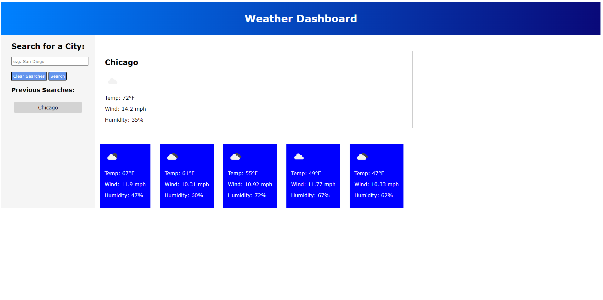

# weather-dashboard
Challenge 6 Server Side APIs

[Weather Dashboard](https://sammythyst.github.io/weather-dashboard/)

## Description
The purpose of this project is to search for a location in which you want to know the weather forecast of. 

## Usage
Search for a city in the search bar and click the search button. Your search will be logged in a "previous searches" section while your most recent result will return the current weather conditions as well as future weather outlooks.